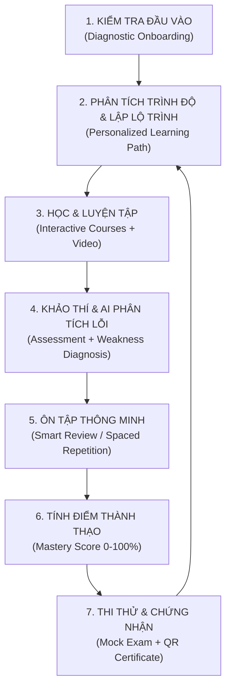

# BẢN VẼ THIẾT KẾ KIẾN TRÚC HỆ THỐNG (ARCHITECTURE PLAN 2026)
**Dự án:** TinHocGenZ AI Learning & Assessment Platform
**Mô hình kiến trúc:** Feature-Driven Modular Monolith + Service Layer Pattern

---

## 1. MÔ HÌNH VÒNG LẶP HỌC TẬP 5 TRỤ CỘT (THE 5-PILLAR EDTECH ENGINE)



---

## 2. CẤU TRÚC THƯ MỤC CHUẨN MODULAR (DIRECTORY STRUCTURE)

```
src/
├── features/                      # Feature-Driven Core Modules
│   ├── auth/                      # Authentication & RBAC
│   ├── onboarding/                # Diagnostic Quiz & Goal Setup
│   ├── dashboard/                 # Action-First Student Dashboard
│   ├── learning-path/             # Roadmap & Skill Trees
│   ├── mastery/                   # Mastery Score Engine (0-100)
│   ├── smart-review/              # Spaced Repetition Error Vault
│   ├── exam-engine/               # Autosave, Timed Exam & Analysis
│   ├── ai-tutor/                  # 3-Mode Contextual AI Companion
│   ├── teacher/                   # Early Warning System & Risk Score
│   ├── certificates/              # Public QR Verifiable Certificate
│   ├── analytics/                 # Learning Events Tracking
│   ├── attendance/                # QR & PIN Geofence Attendance
│   └── schedule/                  # Timetable & Meet Room Hub
├── services/                      # Decoupled Business Logic Layer
│   ├── authService.ts
│   ├── masteryService.ts
│   ├── smartReviewService.ts
│   ├── examService.ts
│   ├── aiTutorService.ts
│   ├── analyticsService.ts
│   ├── certificateService.ts
│   └── earlyWarningService.ts
├── types/                         # TypeScript Domain Interfaces
├── components/                    # Reusable UI & Layout Components
└── utils/                         # Pure utility functions
```

---

## 3. PHÂN HỆ VAI TRÒ & QUYỀN TRUY CẬP (ROLE-BASED ACCESS CONTROL - RBAC)
1. **Student (Học viên):** Onboarding, Learning Path cá nhân, AI Tutor, Smart Review, Thi tính giờ, Nộp bài tập, Điểm danh QR, Nhận chứng chỉ.
2. **Teacher (Giảng viên):** Early Warning Dashboard, Soạn đề thi & bài tập, Chấm điểm bài nộp, AI Copilot soạn câu hỏi, Quản lý lịch dạy & Google Meet, Quản lý điểm danh.
3. **Content Editor (Biên tập viên):** Quản lý ngân hàng câu hỏi, soạn thảo giáo trình và gắn tag kỹ năng nguyên tử.
4. **Exam Manager (Khảo thí):** Quản trị kho đề thi, ngân hàng câu hỏi, thiết lập quy chuẩn tính điểm và giám sát kỳ thi.
5. **Admin / Super Admin (Quản trị viên):** Toàn quyền kiểm soát hệ thống, Tổng đài Google Meet 10 lớp, Phân công giảng viên, Cấu hình SEO & Google Top Rank, Báo cáo Analytics tổng thể.
