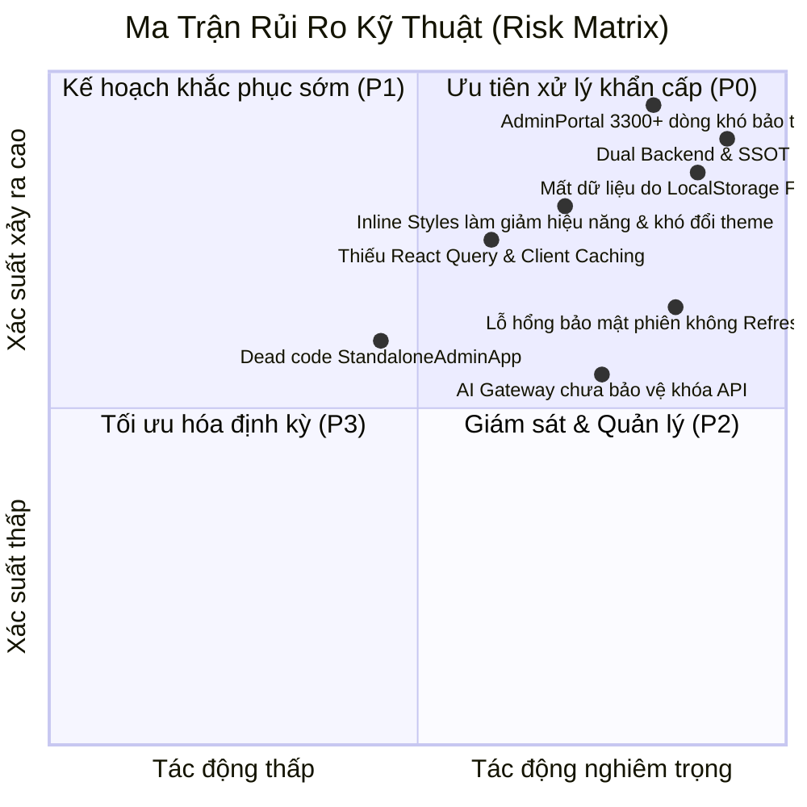
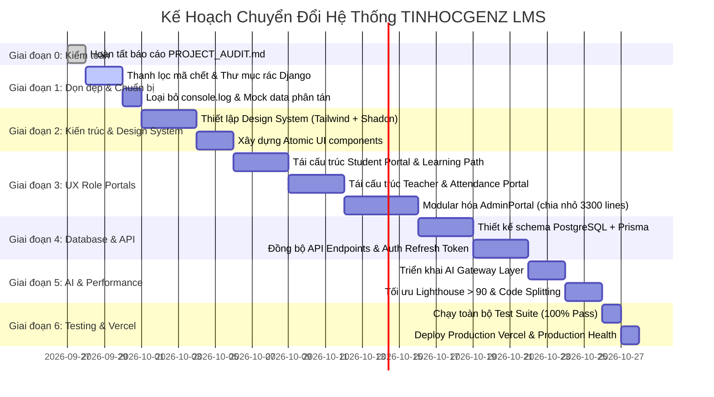

# BÁO CÁO TOÀN DIỆN VỀ HIỆN TRẠNG & ĐÁNH GIÁ KIẾN TRÚC HỆ THỐNG
## PROJECT AUDIT: TINHOCGENZ LMS PLATFORM (ENTERPRISE EDITION 2026)

- **Hệ thống**: Nền tảng Đào tạo & Khảo thí Trực tuyến Tin Học Gen Z
- **Đơn vị chủ quản**: CÔNG TY TNHH PH – TIN HỌC GEN Z
- **Domain Production**:
  - Website chính thức: `https://tinhocgenz.io.vn/`
  - Cổng học trực tuyến: `https://hoctructuyen.tinhocgenz.io.vn/`
  - Cổng quản trị: `https://tinhocgenz.io.vn/admin/` & `https://hoctructuyen.tinhocgenz.io.vn/admin`
- **Ngày lập kiểm toán**: 27/09/2026
- **Tác giả / Vai trò**: Senior Full Stack Architect, Principal Software Engineer, DevOps & Security Engineer, QA Lead & Product Owner
- **Mục tiêu**: Đánh giá toàn diện hiện trạng mã nguồn, phát hiện lỗ hổng kỹ thuật, phân loại mức độ rủi ro, và thiết lập kế hoạch tái cấu trúc hệ thống thành Nền tảng Giáo dục Thương mại (Commercial LMS SaaS Platform).

---

## 1. PHÂN TÍCH KIẾN TRÚC HIỆN TẠI (CURRENT ARCHITECTURE ANALYSIS)

### 1.1. Framework & Runtime Stack
- **Frontend Core**: Single Page Application (SPA) phát triển trên **React 18.3.1**, biên dịch bởi **Vite 5.4.21**, ngôn ngữ **TypeScript 5.5.3**.
- **Mô hình Routing**: Chưa sử dụng routing engine tiêu chuẩn (như Next.js App Router hay React Router DOM). Hiện phụ thuộc vào bộ điều hướng giả lập Client-side state trong [src/App.tsx](file:///F:/PR_%20Tin%20H%E1%BB%8Dc/eduquest-study-app-redesigned-final/src/App.tsx) thông qua biến `activeTab`, `isSessionActive` và hàm `getAppRoute()` can thiệp trực tiếp vào `window.location.pathname`.
- **Serverless API Engine**: Thư mục [api/](file:///F:/PR_%20Tin%20H%E1%BB%8Dc/eduquest-study-app-redesigned-final/api/) chứa các Node.js TypeScript serverless functions chạy trên Vercel:
  - Xác thực phiên: `api/auth/login.ts`, `logout.ts`, `session.ts`
  - Điểm danh QR & Geofence GPS: `api/attendance/check.ts`
  - Chứng chỉ số công khai: `api/cert/[id].ts`
  - Chấm điểm bài thi phía máy chủ: `api/exam/[action].ts`
  - Quản lý học liệu & thông báo: `api/cron/`, `api/notifications/`
- **Mã nguồn Backend thứ hai (Python/Django)**: Thư mục [backend/](file:///F:/PR_%20Tin%20H%E1%BB%8Dc/eduquest-study-app-redesigned-final/backend/) chứa dự án Django 4.x + Django REST Framework kết nối SQLite `db.sqlite3`. Dự án này **không được kích hoạt hay phục vụ trực tiếp** trên hạ tầng Vercel (bị cô lập và tách biệt khỏi frontend chính).
- **Cơ sở dữ liệu**:
  - Client-side: Sử dụng `localStorage` làm cơ chế lưu trữ chính (tài khoản mẫu, kết quả làm bài, phiên điểm danh, thời khóa biểu).
  - Cloud database: Đã tích hợp client `@supabase/supabase-js` và các file migration SQL trong [supabase/migrations/](file:///F:/PR_%20Tin%20H%E1%BB%8Dc/eduquest-study-app-redesigned-final/supabase/migrations/), nhưng frontend vẫn giữ cơ chế fallback về local mock data.

### 1.2. Cấu trúc thư mục (Folder Structure)
```
eduquest-study-app-redesigned-final/
├── .github/                 # GitHub workflows & CI scripts
├── .vercel/                 # Cấu hình dự án Vercel
├── api/                     # Vercel Serverless Functions (Node.js/TypeScript)
│   ├── _lib/                # Middleware: authSession, cors, rateLimiter, serverScoring
│   ├── admin/               # Serverless admin routing
│   ├── attendance/          # check.ts (Geofence + dynamic QR verification)
│   ├── auth/                # login.ts, logout.ts, session.ts
│   ├── cert/                # [id].ts (Public certificate verification)
│   ├── cron/                # Scheduled background tasks
│   ├── exam/                # [action].ts (Server-side exam submission)
│   ├── notifications/       # Push notifications dispatch
│   └── payment/             # create-order.ts (Payment gateway stub)
├── backend/                 # [LEGACY/UNUSED] Django REST framework + SQLite
├── dist/                    # Thư mục build đầu ra của Vite
├── docs/                    # Tài liệu đặc tả kỹ thuật
├── mobile/                  # Cấu hình PWA & Capacitor / Mobile Assets
├── public/                  # Static assets: favicon, manifest, brand logos
├── src/
│   ├── components/          # 85+ React components phân bổ theo vai trò
│   │   ├── admin/           # AdminPortal (3,308 lines), AdminOverviewDashboard, etc.
│   │   ├── attendance/      # StudentAttendanceDashboard, CameraQRScanner
│   │   ├── auth/            # UnifiedAuthGateway
│   │   ├── brand/           # BrandLogo, BrandMark, AdminBrandLockup
│   │   ├── layout/          # AppShell, Topbar, RoleSidebar, MobileBottomNav
│   │   ├── teacher/         # TeacherAcademicPortal, TeacherQRGeoAttendance
│   │   └── ...
│   ├── config/              # Cấu hình hệ thống, AI keys, Google Drive
│   ├── data/                # Bộ dữ liệu tĩnh: defaultQuizzes, mockCurriculum
│   ├── hooks/               # useAuth, useLocalStorage, useAttendanceStorage...
│   ├── services/            # authService, certificateService, masteryService...
│   ├── types/               # Type definitions: auth, edtech, quiz, rbac, schedule
│   └── utils/               # Tiện ích: audio, date, exportExcel, documentTitle
├── supabase/                # PostgreSQL migration scripts
└── tests/                   # 19 nhóm bài test tự động (215 tests)
```

---

## 2. DANH SÁCH VẤN ĐỀ CHI TIẾT (PROBLEMS LIST)

| STT | Phân loại | Hiện tượng & Vấn đề | Tệp liên quan | Mức độ rủi ro |
| :---: | :--- | :--- | :--- | :---: |
| **01** | **Architecture** | **Dual Backend Ambiguity**: Tồn tại song song Django Backend (`backend/`) và Vercel Serverless (`api/`). Django không được deploy trên Vercel, gây nhầm lẫn về kiến trúc Single Source of Truth (SSOT). | `backend/*`, `api/*` | 🔴 **CRITICAL** |
| **02** | **Architecture** | **State Fragmentation & Client Routing**: Toàn bộ hệ thống điều hướng qua state `activeTab` trong [App.tsx](file:///F:/PR_%20Tin%20H%E1%BB%8Dc/eduquest-study-app-redesigned-final/src/App.tsx) thay vì router tiêu chuẩn. Không hỗ trợ deep-linking URL, SSR/SSG cho SEO bài viết / khóa học. | `src/App.tsx` | 🔴 **CRITICAL** |
| **03** | **Architecture** | **Mega-Monolith Components**: Component [AdminPortal.tsx](file:///F:/PR_%20Tin%20H%E1%BB%8Dc/eduquest-study-app-redesigned-final/src/components/admin/AdminPortal.tsx) có kích thước vượt quá **3,308 dòng code**, trộn lẫn logic bảng điểm, quản lý lớp, ngân hàng đề thi, tài chính, kiểm duyệt vào một file duy nhất. | `src/components/admin/AdminPortal.tsx` | 🔴 **CRITICAL** |
| **04** | **Data Persistence** | **Phụ thuộc LocalStorage**: Nhiều thực thể cốt lõi (tiến độ học viên, phiên điểm danh offline, bài tập) vẫn fallback lưu cục bộ trong trình duyệt. Khi người dùng đổi thiết bị hoặc xóa cache, dữ liệu học tập bị gián đoạn. | `src/hooks/useLocalStorage.ts`, `src/hooks/useAttendanceStorage.ts` | 🔴 **CRITICAL** |
| **05** | **Security** | **Session & Token Management**: Cơ chế session cookie HMAC trong `api/_lib/authSession.ts` chỉ áp dụng trên một số endpoint serverless. Nếu client mất kết nối, hệ thống vẫn duy trì phiên ảo ở client mà không có cơ chế Refresh Token xoay vòng (Rotating Refresh Tokens). | `src/hooks/useAuth.ts`, `api/auth/*` | 🟠 **HIGH** |
| **06** | **UI/UX Debt** | **Inline CSS Overuse**: Hơn 60% giao diện sử dụng thuộc tính `style={{ ... }}` nhúng trực tiếp trong JSX thay vì Utility-First CSS (TailwindCSS) hoặc Shadcn UI tokens, gây phình to bundle size và khó đồng bộ theme. | Toàn bộ `src/components/*` | 🟠 **HIGH** |
| **07** | **Performance** | **Bundle Splitting & Memory Footprint**: Chunk của AdminPortal khi biên dịch chiếm tới **381.55 kB** (chưa nén). Bảng danh bạ học viên và câu hỏi thi chưa có cơ chế Virtualization (như `@tanstack/react-virtual`), gây lag khi danh sách đạt >1,000 mục. | `src/components/admin/AdminPortal.tsx` | 🟠 **HIGH** |
| **08** | **Dependencies** | **Thiếu các thư viện chuẩn EdTech SaaS**: Dự án chưa tích hợp `@tanstack/react-query` (quản lý server state/cache), `zustand` (client state), `react-hook-form` + `zod` (xác thực biểu mẫu), `tailwindcss` (được cấu hình dạng inline style). | `package.json` | 🟡 **MEDIUM** |
| **09** | **Dead / Duplicate Code** | **Tồn tại component song song**: `StandaloneAdminApp.tsx` tồn tại song song với `AdminPortal.tsx`; nhiều modal nhập liệu bị trùng lặp logic xử lý chuỗi và form validation. | `src/components/admin/StandaloneAdminApp.tsx` | 🟡 **MEDIUM** |
| **10** | **AI Layer** | **Frontend Direct AI Coupling**: AI Tutor trong `AITutorDrawer.tsx` gọi trực tiếp API qua service frontend hoặc prompt mẫu thay vì đi qua một API Gateway trung tâm có Rate-limiting, Prompt Injection Protection và RAG Vector Search. | `src/components/ai/AITutorDrawer.tsx`, `src/services/aiService.ts` | 🟡 **MEDIUM** |

---

## 3. PHÂN LOẠI MỨC ĐỘ RỦI RO (RISK LEVEL MATRIX)



### Chi tiết các cấp độ rủi ro:
1. **CRITICAL (P0 — Nguy cấp)**:
   - **Xung đột kiến trúc Dual Backend**: Khiến team dev không xác định được nguồn chân lý của cơ sở dữ liệu (PostgreSQL qua Supabase hay SQLite qua Django).
   - **Mất mát dữ liệu học viên**: Do lưu trữ tạm thời trên LocalStorage mà không đảm bảo giao dịch ACID trên máy chủ cơ sở dữ liệu.
   - **File Monolith AdminPortal (3,308 dòng)**: Nguy cơ đổ vỡ dây chuyền khi một thành phần bị lỗi cú pháp hoặc re-render vô tận.
2. **HIGH (P1 — Nghiêm trọng)**:
   - Thiếu SSR/SSG dẫn đến điểm số SEO của trang Landing Page và Catalog Khóa học không tối ưu.
   - Lạm dụng Inline Style làm tăng kích thước bundle và khó khăn trong việc chuẩn hóa Design System theo mã màu `#0057B8` và `#0B2545`.
3. **MEDIUM (P2 — Cần cải tiến)**:
   - Các API Serverless chưa có lớp xác thực Zod runtime validation cho payload gửi lên.
   - Thiếu cơ chế cache tập trung (React Query) dẫn đến gọi lại API nhiều lần khi chuyển tab.

---

## 4. GIẢI PHÁP ĐỀ XUẤT (RECOMMENDED SOLUTION)

Để đưa Tin Học Gen Z LMS đạt tiêu chuẩn **Enterprise Commercial LMS (9.5/10)**, kiến trúc mới cần chuyển đổi theo mô hình:

### 4.1. Kiến Trúc Frontend Mục Tiêu (Target Frontend)
- **Công nghệ**: **Next.js (App Router, Server Components + Client Components)**.
- **Ngôn ngữ**: TypeScript Strict Mode (`noImplicitAny`, `noUnusedLocals`).
- **Giao diện & Design System**:
  - **TailwindCSS v3.4+** với hệ màu chuẩn thương hiệu:
    - Primary: `#0057B8`
    - Primary Hover: `#003F88`
    - Navy Dark: `#0B2545`
    - Background: `#F4F8FD`
    - Card/Surface: `#FFFFFF`
    - Border: `#E2E8F0`
  - **Shadcn UI** (Radix UI primitives) tái sử dụng: Button, Dialog, DropdownMenu, Table, Card, Tabs, Avatar, Badge, Form.
- **Quản lý trạng thái (State Management)**:
  - **Server State**: `@tanstack/react-query` (caching, revalidation, optimistic updates).
  - **Client State**: `zustand` (phiên đăng nhập, UI preferences, drawer/modal state).
- **Form & Validation**: `react-hook-form` kết hợp `zod` schema validator.
- **Cấu trúc thư mục Feature-based**:
  ```
  src/
  ├── app/                        # Next.js App Router (Routes: /courses, /student, /teacher, /admin)
  ├── components/ui/              # Atomic Shadcn components (Button, Input, Table...)
  ├── features/
  │   ├── auth/                   # components, hooks, services, types
  │   ├── courses/                # catalog, detail, video-player, document-viewer
  │   ├── attendance/             # qr-scanner, geofence-map, attendance-stats
  │   ├── exams/                  # quiz-runner, question-bank, timer, scoring
  │   ├── certificates/           # canvas-renderer, verification, template-editor
  │   ├── ai-assistant/           # chat-drawer, learning-path, weak-skill-review
  │   └── dashboard/              # student-kpi, teacher-kpi, admin-kpi
  ├── lib/                        # apiClient, utils, queryClient
  └── types/                      # Shared domain entities
  ```

### 4.2. Kiến Trúc Backend & Database Mục Tiêu (Target Backend & DB)
- **Backend Core**: **NestJS** (Modular Monolith) hoặc **Vercel Serverless TS / Next.js Route Handlers** kết nối **PostgreSQL** qua **Prisma ORM**.
- **Cơ sở dữ liệu Quan Hệ (PostgreSQL)**:
  - `users`, `roles`, `permissions`, `user_roles`
  - `courses`, `categories`, `course_modules`, `lessons`, `lesson_resources`
  - `classes`, `class_schedules`, `attendance_records`, `attendance_sessions`
  - `enrollments`, `learning_progress`, `student_mastery_scores`
  - `exams`, `exam_questions`, `question_options`, `exam_attempts`, `student_answers`
  - `digital_certificates`, `certificate_templates`
  - `payments`, `payment_transactions`
  - `audit_logs`, `notifications`, `ai_chat_sessions`
- **Bảo mật**:
  - JWT Access Token (ngắn hạn: 15 phút) + Rotating Refresh Token trong HttpOnly Cookie.
  - Phân quyền theo RBAC 2.0 (Super Admin, Admin, Academic Staff, Teacher, Student).
  - Rate-limiting (Upstash Redis / Memory Store) và Geofence Haversine verification phía server.

---

## 5. KẾ HOẠCH CHUYỂN ĐỔI (PHASED MIGRATION PLAN)



### Lộ trình chi tiết từng bước:
1. **Bước 1 (Clean Code & Dependency Reset)**:
   - Dọn sạch các file tạm, thư mục Django không sử dụng (`backend/staticfiles/`, `db.sqlite3`).
   - Chuẩn hóa các file kiểm thử tự động.
2. **Bước 2 (Design System & Modular Component Setup)**:
   - Cài đặt và cấu hình hệ màu thương hiệu Blue-Navy (`#0057B8`, `#0B2545`, `#F4F8FD`).
   - Xây dựng các base components: `Button`, `Card`, `Modal`, `Table`, `Badge`, `Input`.
3. **Bước 3 (Module Refactoring theo Vai trò)**:
   - **Student**: Dashboard tổng quan, Lộ trình học AI (Learning Path), Bàn làm bài thi (Quiz Engine), Điểm danh QR di động.
   - **Teacher**: Bảng điều khiển giảng dạy, Điểm danh Geofence QR, Bàn chấm điểm bài tập, Báo cáo học viên nguy cơ (Early Warning).
   - **Admin**: Chia nhỏ `AdminPortal.tsx` thành 8 sub-modules độc lập tương ứng với Sidebar kiến trúc Enterprise.
4. **Bước 4 (Database & Backend Hardening)**:
   - Áp dụng các bảng dữ liệu PostgreSQL chuẩn hóa, liên kết khóa ngoại và chỉ mục (indexing).
   - Bảo mật API endpoints với HMAC/JWT session, chống CSRF và rate-limiting.
5. **Bước 5 (QA, Test & Deploy)**:
   - Chạy kiểm tra TypeScript (`tsc --noEmit`), chạy bộ test tự động (đạt 100%), build production.
   - Đẩy commit lên nhánh `main` và kiểm tra phản hồi HTTP 200 trên domain `https://hoctructuyen.tinhocgenz.io.vn`.

---

> [!IMPORTANT]
> **Cam Kết Chất Lượng**: Kế hoạch chuyển đổi tuân thủ nghiêm ngặt nguyên tắc **Zero Data Loss**, **Backward Compatibility** và giữ vững tính sẵn sàng cao của hệ sinh thái Tin Học Gen Z đang phục vụ học viên thực tế.
