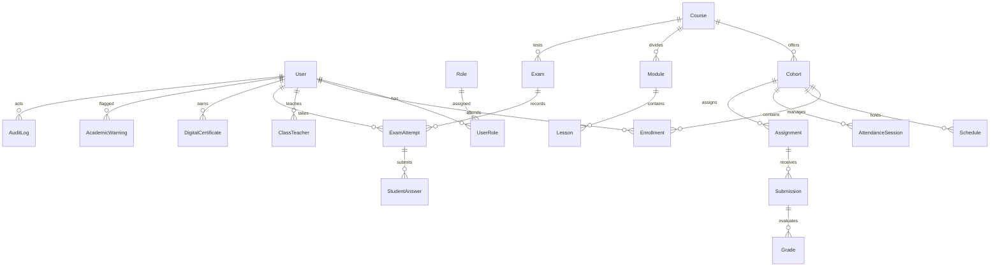

# THIẾT KẾ CƠ SỞ DỮ LIỆU TẬP TRUNG (DATABASE DESIGN & SCHEMA)
**Hệ Quản Trị Cơ Sở Dữ Liệu Mục Tiêu:** PostgreSQL 16+  
**ORM:** Django ORM (Python 3.11 / 3.13)  
**Tiêu chuẩn thiết kế:** Chuẩn hóa 3NF, Foreign Key ràng buộc toàn vẹn, Index truy vấn nhanh, không phụ thuộc localStorage.

---

## I. SƠ ĐỒ THỰC THỂ QUAN HỆ CỐT LÕI (ENTITY RELATIONSHIP OVERVIEW)

---

## II. ĐỊNH NGHĨA CÁC BẢNG & TRƯỜNG DỮ LIỆU CHI TIẾT

### 1. Phân Hệ Người Dùng & Phân Quyền (`apps.accounts`)
* **`accounts_user`**
  * `id`: `UUID` (Primary Key, default=uuid4)
  * `username`: `VARCHAR(50)` (Unique, Index) — Ví dụ: `THGZ01`, `GV01`, `admin`
  * `email`: `VARCHAR(255)` (Unique, Nullable)
  * `password`: `VARCHAR(255)` — Chuỗi băm Argon2id / PBKDF2
  * `full_name`: `VARCHAR(150)`
  * `phone`: `VARCHAR(20)`
  * `is_active`: `BOOLEAN` (Default=True)
  * `must_change_password`: `BOOLEAN` (Default=False)
  * `date_joined`: `TIMESTAMPTZ` (Default=now())
  * `last_login`: `TIMESTAMPTZ` (Nullable)

* **`accounts_role`**
  * `id`: `VARCHAR(30)` (Primary Key) — `student`, `teacher`, `academic`, `admin`
  * `name`: `VARCHAR(100)`
  * `description`: `TEXT`

* **`accounts_user_role`**
  * `id`: `BIGSERIAL` (Primary Key)
  * `user_id`: `UUID` (FK -> accounts_user, ON DELETE CASCADE)
  * `role_id`: `VARCHAR(30)` (FK -> accounts_role, ON DELETE CASCADE)
  * `created_at`: `TIMESTAMPTZ` (Default=now())
  * *Constraint:* `UNIQUE(user_id, role_id)`

---

### 2. Phân Hệ Khóa Học & Lớp Học (`apps.courses`, `apps.classes`)
* **`courses_course`**
  * `id`: `VARCHAR(50)` (Primary Key) — Ví dụ: `office-fast-3in1`, `cc-cntt-basic`, `ai-office`
  * `code`: `VARCHAR(30)` (Unique, Index)
  * `title`: `VARCHAR(255)`
  * `short_desc`: `TEXT`
  * `total_sessions`: `INTEGER` (Default=6)
  * `target_badge`: `VARCHAR(50)` — `MOS`, `IC3 GS6`, `Bộ GD&ĐT`
  * `is_published`: `BOOLEAN` (Default=True)
  * `order_index`: `INTEGER` (Default=0)

* **`classes_cohort` (Lớp học)**
  * `id`: `UUID` (Primary Key)
  * `class_code`: `VARCHAR(50)` (Unique, Index) — Ví dụ: `K26-WE01`, `K26-CC01`
  * `name`: `VARCHAR(255)`
  * `course_id`: `VARCHAR(50)` (FK -> courses_course)
  * `start_date`: `DATE`
  * `end_date`: `DATE` (Nullable)
  * `status`: `VARCHAR(20)` (Default='active') — `active`, `completed`, `archived`
  * `room_name`: `VARCHAR(100)` — Ví dụ: `Phòng LAB 01 (Tầng 2)`
  * `meeting_url`: `VARCHAR(255)` — Google Meet Link (Bảo mật, chỉ người trong lớp nhìn thấy)

* **`classes_enrollment` (Học viên vào lớp)**
  * `id`: `UUID` (Primary Key)
  * `cohort_id`: `UUID` (FK -> classes_cohort, ON DELETE CASCADE)
  * `student_id`: `UUID` (FK -> accounts_user, ON DELETE CASCADE)
  * `enrolled_at`: `TIMESTAMPTZ` (Default=now())
  * `status`: `VARCHAR(20)` (Default='enrolled') — `enrolled`, `passed`, `dropped`
  * *Constraint:* `UNIQUE(cohort_id, student_id)`

---

### 3. Phân Hệ Điểm Danh Thông Minh (`apps.attendance`)
* **`attendance_session` (Buổi học & Ca điểm danh)**
  * `id`: `UUID` (Primary Key)
  * `cohort_id`: `UUID` (FK -> classes_cohort)
  * `teacher_id`: `UUID` (FK -> accounts_user)
  * `session_date`: `DATE`
  * `session_number`: `INTEGER` (Buổi số 1..12)
  * `is_open`: `BOOLEAN` (Default=False)
  * `qr_token`: `VARCHAR(100)` (Server-side generated, xoay vòng)
  * `qr_expires_at`: `TIMESTAMPTZ`
  * `pin_code`: `VARCHAR(10)`
  * `lab_lat`: `FLOAT` (Vĩ độ phòng LAB)
  * `lab_lng`: `FLOAT` (Kinh độ phòng LAB)
  * `max_distance_meters`: `INTEGER` (Default=100)

* **`attendance_record`**
  * `id`: `UUID` (Primary Key)
  * `session_id`: `UUID` (FK -> attendance_session, ON DELETE CASCADE)
  * `student_id`: `UUID` (FK -> accounts_user)
  * `status`: `VARCHAR(20)` — `present`, `absent`, `late`, `excused`
  * `checkin_method`: `VARCHAR(20)` — `qr_scan`, `pin_code`, `manual`
  * `checkin_time`: `TIMESTAMPTZ` (Nullable)
  * `verified_coords`: `VARCHAR(100)` (Vĩ độ, Kinh độ lúc học viên quét mã)
  * `note`: `TEXT` (Nullable)
  * *Constraint:* `UNIQUE(session_id, student_id)`

---

### 4. Phân Hệ Ngân Hàng Câu Hỏi & Khảo Thí (`apps.assessments`)
* **`assessments_question`**
  * `id`: `UUID` (Primary Key)
  * `course_id`: `VARCHAR(50)` (FK -> courses_course)
  * `skill_id`: `VARCHAR(50)` (Index) — Ví dụ: `word_formatting`, `excel_vlookup`
  * `content`: `TEXT` (Nội dung câu hỏi)
  * `options`: `JSONB` — Mảng 4 phương án `[{id, text}]`
  * `correct_answer_id`: `VARCHAR(10)` (Khóa đáp án chỉ lưu ở Server!)
  * `explanation`: `TEXT` (Giải thích chi tiết vì sao đúng)
  * `difficulty`: `VARCHAR(20)` — `easy`, `medium`, `hard`

* **`assessments_exam`**
  * `id`: `UUID` (Primary Key)
  * `course_id`: `VARCHAR(50)` (FK -> courses_course)
  * `title`: `VARCHAR(255)`
  * `duration_minutes`: `INTEGER` (Default=45)
  * `passing_percentage`: `INTEGER` (Default=70)
  * `mode`: `VARCHAR(20)` — `practice`, `official_exam`

* **`assessments_attempt` (Lượt thi học viên)**
  * `id`: `UUID` (Primary Key)
  * `exam_id`: `UUID` (FK -> assessments_exam)
  * `student_id`: `UUID` (FK -> accounts_user)
  * `started_at`: `TIMESTAMPTZ` (Default=now())
  * `submitted_at`: `TIMESTAMPTZ` (Nullable)
  * `score`: `INTEGER` (Default=0)
  * `total_questions`: `INTEGER`
  * `percentage`: `FLOAT` (Default=0)
  * `is_passed`: `BOOLEAN` (Default=False)
  * `switch_tab_count`: `INTEGER` (Số lần rời màn hình thi)
  * `answers_draft`: `JSONB` (Autosave tiến độ làm bài)

---

### 5. Phân Hệ Chứng Chỉ Số (`apps.certificates`)
* **`certificates_certificate`**
  * `id`: `UUID` (Primary Key)
  * `certificate_code`: `VARCHAR(50)` (Unique, Index) — Ví dụ: `PH-MOS-2026-X89B`
  * `student_id`: `UUID` (FK -> accounts_user)
  * `course_id`: `VARCHAR(50)` (FK -> courses_course)
  * `final_score`: `FLOAT`
  * `issued_at`: `TIMESTAMPTZ` (Default=now())
  * `blockchain_hash`: `VARCHAR(128)` (SHA-256 mã hóa chứng chỉ)
  * `is_revoked`: `BOOLEAN` (Default=False)

---

### 6. Phân Hệ Cảnh Báo Sớm & Audit Log (`apps.analytics`, `apps.audit`)
* **`analytics_academic_warning`**
  * `id`: `UUID` (Primary Key)
  * `student_id`: `UUID` (FK -> accounts_user)
  * `cohort_id`: `UUID` (FK -> classes_cohort)
  * `risk_level`: `VARCHAR(20)` — `CRITICAL`, `HIGH`, `MEDIUM`, `LOW`
  * `reasons`: `JSONB` — `["Vắng 2 buổi liên tiếp", "Chưa nộp bài tập Word số 2"]`
  * `is_resolved`: `BOOLEAN` (Default=False)
  * `created_at`: `TIMESTAMPTZ` (Default=now())

* **`audit_log`**
  * `id`: `BIGSERIAL` (Primary Key)
  * `actor_id`: `UUID` (FK -> accounts_user, Nullable)
  * `action`: `VARCHAR(100)` — `LOGIN`, `GRADE_UPDATE`, `ROLE_CHANGE`, `PASSWORD_RESET`
  * `resource`: `VARCHAR(100)`
  * `ip_address`: `INET`
  * `payload`: `JSONB`
  * `timestamp`: `TIMESTAMPTZ` (Default=now())
