# Enterprise LMS SaaS Information Architecture

**Product:** PH Digital Education / EduQuest LMS  
**Target:** Enterprise LMS 9/10  
**Scope:** Information architecture, roles, workflows, permissions, data relationships, scalability, and UI/UX  
**Compatibility rule:** Existing database tables, model identifiers, storage keys, component callbacks, and API endpoints remain valid during migration.

## Executive decision

The LMS should be organized around eight business capabilities, not around implementation artifacts such as pages, file types, or individual tools:

1. Dashboard
2. User Management
3. Learning Management
4. Assessment
5. Content Library
6. AI Center
7. Analytics
8. System

The current separate lecture, exam, media, review queue, Meet hub, certificate, and sync menus are not independent business domains. They are steps or resources inside larger workflows and should become child views, tabs, or contextual actions.

The target product model is a modular LMS with one shared domain layer, one permission-aware navigation definition, role-scoped workspaces, and additive compatibility adapters around the existing APIs.

---

## Current-state analysis

### What exists today

- `StandaloneAdminApp.tsx` defines one admin menu while `RoleSidebar.tsx` defines another. Labels, route IDs, grouping, and permissions can diverge.
- `AdminPortal.tsx` owns many unrelated workflows in one large component: students, teachers, schedules, Meet rooms, exams, questions, grading, certificates, learning resources, SEO, and automation.
- The frontend already defines fine-grained permissions in `src/types/rbac.ts`, but navigation and page authorization are not yet consistently derived from the same policy.
- The Django backend already models users, courses, classes, enrollments, assignments, submissions, assessments, attendance, certificates, analytics warnings, and audit logs.
- The Supabase schema uses a smaller role set than the Django model. Django supports `student`, `teacher`, `academic`, `admin`, and `super_admin`; the Supabase `users` constraint currently supports only `student`, `teacher`, and `admin`.
- The resource hub already has a useful governance lifecycle through resources, versions, files, review queues, review actions, sync jobs, and logs.
- Some operational state remains in client storage and large React props. This makes multi-device use, auditability, concurrency, and organization-level reporting difficult.

### Main business problems

| Problem | Business effect | Target correction |
|---|---|---|
| Two admin menu definitions | Inconsistent navigation and duplicated maintenance | One canonical navigation registry filtered by permissions |
| Pages grouped by artifact type | Users must understand the code structure to complete work | Group pages by end-to-end job and lifecycle |
| Lecture, exam, and media exposed as separate silos | Duplicate upload, tagging, publishing, and search workflows | Lessons live in courses, exams live in assessment, media lives in the content library |
| Role names differ across frontend, Django, and Supabase | Incorrect access and difficult audits | Canonical four-role product model with legacy role aliases |
| Monolithic admin component | Slow releases and high regression risk | Capability modules with route-level boundaries |
| UI visibility treated as access control | Hidden actions can still be called directly | Server-side RBAC plus object-level scope checks |
| Data linked by codes or local state | Weak referential integrity and reporting | Preserve old fields, add stable foreign keys and compatibility views |
| Reports embedded inside operational screens | Reactive rather than proactive management | Dedicated analytics workspace with drill-through actions |

---

# 1. New sidebar structure

## Canonical sidebar

Only the following eight entries appear at level one. Children are collapsible and permission-filtered.

### Dashboard

- Overview
- My Work Queue
- Alerts and Exceptions
- Recent Activity

Dashboard content changes by role; it is not a collection of static charts.

### User Management

- All Users
- Students
- Teachers
- Academic Staff
- Roles and Access
- Invitations and Account Status

`Roles and Access` is visible only to Super Admin. Teachers see only students within assigned classes. Students see only their own profile, exposed as `My Profile` in their role workspace.

### Learning Management

- Courses
  - Course Overview
  - Curriculum
  - Modules and Lessons
  - Delivery Settings
- Classes and Cohorts
- Enrollments
- Schedule and Sessions
- Attendance
- Live Classroom
- Learning Progress

There is no separate `Lecture` menu. A lesson is authored and ordered inside a course curriculum. Live meeting links belong to scheduled class sessions, not to a global Meet-room silo.

### Assessment

- Assessment Overview
- Question Bank
- Assignments
- Exams and Quizzes
- Grading Queue
- Results and Moderation
- Certificates

There is no separate top-level `Exam` menu. Question authoring, exam assembly, delivery, attempts, grading, moderation, results, and certification form one lifecycle.

### Content Library

- All Content
- My Content
- Collections and Tags
- Review Queue
- Published Content
- Sources and Sync
- Versions and Usage

There is no separate `Media Center`. Video, PDF, slide, image, template, SCORM/package, and external links are resource types in one library. Resources are reused by lessons, questions, assignments, and announcements.

### AI Center

- AI Workspace
- Content Generator
- Question Generator
- Tutor and Copilot
- Recommendations
- Automations
- AI Governance and Usage

Generation never publishes directly. AI output enters the same draft-review-publish lifecycle as human-authored content.

### Analytics

- Executive Overview
- Learning Analytics
- Assessment Analytics
- Engagement and Attendance
- At-risk Students
- Content Performance
- Operational Reports
- Saved Reports and Exports

### System

- Organization Settings
- Integrations
- Notifications
- Security and Sessions
- Audit Log
- Data Import and Export
- Backup and Recovery
- Branding and SEO
- Platform Health

## Role-specific sidebar exposure

The information architecture remains stable, but users see only relevant capabilities.

| Top-level area | Super Admin | Academic Manager | Teacher | Student |
|---|---:|---:|---:|---:|
| Dashboard | Yes | Yes | Yes | Yes |
| User Management | Full | Students and teachers | Assigned students | My profile only |
| Learning Management | Full | Full academic scope | Assigned courses/classes | Enrolled learning |
| Assessment | Full | Full academic scope | Author and grade assigned scope | Take and review own work |
| Content Library | Full governance | Curate and publish | Create, submit, reuse | Read published content |
| AI Center | Configure and use | Use and approve | Copilot and generators | Tutor and recommendations |
| Analytics | Global | Organization/branch | Assigned classes | Own progress |
| System | Full | Limited operations | Personal preferences | Personal preferences |

## Legacy-to-target navigation mapping

Existing IDs remain valid as aliases so bookmarks, callbacks, and `AdminPortalSubTab` integrations do not break.

| Current item or ID | New location |
|---|---|
| `overview` | Dashboard / Overview |
| `student_directory`, `students_mgmt` | User Management / Students |
| `teachers`, `teachers_mgmt` | User Management / Teachers |
| `roles`, `permissions` | User Management / Roles and Access |
| `courses_mgmt` | Learning Management / Courses |
| `lessons_mgmt` | Learning Management / Courses / Modules and Lessons |
| `classes_mgmt` | Learning Management / Classes and Cohorts |
| `schedules`, `teaching_schedule` | Learning Management / Schedule and Sessions |
| `meet_hub` | Learning Management / Live Classroom |
| `attendance_mgmt` | Learning Management / Attendance |
| `exams` | Assessment / Exams and Quizzes |
| `question_bank` | Assessment / Question Bank |
| `grading_assignments`, `assignments_mgmt` | Assessment / Assignments or Grading Queue |
| `certificates` | Assessment / Certificates |
| `media_library` | Content Library / All Content |
| `learning_sources` | Content Library / Sources and Sync |
| `review_queue` | Content Library / Review Queue |
| `tinhocgenz_studio` | Content Library / Published Content or Collections |
| `sync_history` | Content Library / Sources and Sync / History |
| `failing_sources` | Content Library / Sources and Sync / Exceptions |
| `automation_settings` | AI Center / Automations |
| `early_warning` | Analytics / At-risk Students |
| `quality_reports`, `data_analytics`, `reports` | Analytics |
| `integrations` | System / Integrations |
| `seo_center`, `system_settings` | System / Branding and SEO or Organization Settings |
| `backup_security`, Django Admin shortcut | System / Security, Backup, and Platform Health |

---

# 2. Component hierarchy

## Target application hierarchy

```text
LmsApplication
├── AuthBoundary
│   ├── SessionProvider
│   ├── PermissionProvider
│   └── OrganizationScopeProvider
├── RoleWorkspaceRouter
│   ├── AdminWorkspace
│   ├── AcademicManagerWorkspace
│   ├── TeacherWorkspace
│   └── StudentWorkspace
└── LmsShell
    ├── GlobalHeader
    │   ├── OrganizationSwitcher
    │   ├── GlobalSearch
    │   ├── CreateMenu
    │   ├── NotificationCenter
    │   └── UserMenu
    ├── CapabilitySidebar
    │   ├── PermissionFilteredSection
    │   └── ContextualBadge
    ├── ContextBar
    │   ├── Breadcrumbs
    │   ├── ScopeFilter
    │   └── PageActions
    └── RouteOutlet
        ├── DashboardModule
        ├── UserManagementModule
        ├── LearningManagementModule
        ├── AssessmentModule
        ├── ContentLibraryModule
        ├── AiCenterModule
        ├── AnalyticsModule
        └── SystemModule
```

## Feature module pattern

Every capability module uses the same internal structure:

```text
<Capability>Module
├── routes.ts                 # Route definitions and legacy aliases
├── navigation.ts             # Labels, icons, permissions, badges
├── permissions.ts            # Capability and object-scope rules
├── pages/                     # Route-level orchestration only
├── components/               # Reusable business UI
├── services/                 # Existing API calls through adapters
├── queries/                  # Server-state fetching and cache keys
├── models/                   # View models, not duplicated API entities
└── tests/                    # Permission, workflow, and rendering tests
```

## Recommended React decomposition

```text
src/
├── app/
│   ├── lmsNavigation.ts
│   ├── routeAliases.ts
│   └── permissionPolicy.ts
├── components/
│   ├── layout/
│   │   ├── LmsShell.tsx
│   │   ├── CapabilitySidebar.tsx
│   │   ├── ContextBar.tsx
│   │   └── GlobalSearch.tsx
│   └── admin/
│       ├── adapters/
│       │   └── legacyAdminPortalAdapter.tsx
│       └── modules/
│           ├── dashboard/
│           ├── users/
│           ├── learning/
│           ├── assessment/
│           ├── content/
│           ├── ai/
│           ├── analytics/
│           └── system/
└── services/
    ├── api/                   # Existing API clients remain the source
    └── compatibility/         # DTO and role aliases
```

## Existing component migration map

| Existing component | Target responsibility |
|---|---|
| `StandaloneAdminApp` | Temporary compatibility host; then replaced by `LmsShell` |
| `RoleSidebar` | Replaced by `CapabilitySidebar` using one navigation registry |
| `AdminPortal` | Split into eight route modules; retained temporarily as a legacy adapter |
| `AdminOverviewDashboard` | Dashboard / Overview |
| `TeacherAssignmentManager` | Assessment / Assignments and Grading Queue |
| `ScheduleCalendar` | Learning Management / Schedule and Sessions |
| `LearningResourceHub` | Content Library |
| `CertificateManager` | Assessment / Certificates |
| `EarlyWarningDashboard` | Analytics / At-risk Students |
| `PermissionManagerModal` | User Management / Roles and Access |
| `SystemDataCenterModal` | System / Data, Backup, and Recovery |
| `AITutorDrawer` and AI services | AI Center plus contextual assistant entry points |

`AdminPortal` props and current callbacks should be wrapped, not immediately removed. Each extracted page receives the same data and handlers until its API-backed query replaces the prop contract.

---

# 3. User flow

## Primary learning value stream

```mermaid
flowchart LR
    A[Create or invite user] --> B[Assign role and scope]
    B --> C[Publish course curriculum]
    C --> D[Create class or cohort]
    D --> E[Assign teacher and schedule]
    E --> F[Enroll students]
    F --> G[Deliver lessons and resources]
    G --> H[Track attendance and progress]
    H --> I[Run assignments and exams]
    I --> J[Grade and moderate results]
    J --> K[Issue certificate]
    K --> L[Analytics and AI recommendations]
    L --> G
```



## Content lifecycle

```text
Draft → In Review → Changes Requested → Approved → Scheduled/Published → Archived
```

- A teacher creates or imports a reusable resource in Content Library.
- The resource is attached to a course lesson, assignment, or question without making another copy.
- Academic Manager reviews learning accuracy and publishing metadata.
- Super Admin governs restricted file types, external sources, retention, and integrations.
- Publishing creates a versioned reference; editing published content creates a new draft version.
- Usage analytics show every course, lesson, assessment, and cohort that consumes the resource.

## Assessment lifecycle

```text
Learning outcomes
  → assessment blueprint
  → question selection/authoring
  → draft assessment
  → academic review
  → publish and schedule
  → attempt/autosave
  → auto/manual grading
  → moderation and lock
  → result release
  → certificate eligibility
```

Assignments, quizzes, and formal exams share questions, rubrics, attempts, grading, and results. Their different rules are represented by `assessment_type` and policy settings, not by separate application silos.

## Role journeys

### Super Admin

1. Opens Dashboard and reviews platform health, security events, sync failures, and organization KPIs.
2. Manages role policies and integration credentials in System.
3. Investigates exceptions through drill-through pages rather than editing operational records from charts.
4. Reviews immutable audit history for role, grade, publication, and configuration changes.

### Academic Manager

1. Reviews enrollment, schedule conflicts, content approvals, grading backlog, and at-risk alerts.
2. Creates a class from a published course, assigns teachers, schedules sessions, and enrolls students.
3. Reviews content and official assessments before publication.
4. Moderates locked results and approves certificate eligibility.
5. Uses Analytics to open an intervention task for a class or student.

### Teacher

1. Opens `My Work Queue` for today's classes, attendance, pending grading, and content feedback.
2. Enters an assigned class workspace containing roster, schedule, lessons, attendance, assignments, and progress.
3. Creates content or questions with AI assistance and submits them for review.
4. Grades assigned submissions, gives feedback, and flags students for academic support.

### Student

1. Opens a personalized Dashboard with next lesson, due work, schedule, progress, and recommendations.
2. Consumes the published curriculum and reusable resources for enrolled courses.
3. Checks in, submits assignments, takes assessments, and receives results according to release policy.
4. Uses AI Tutor within the current lesson context and views only personal analytics and certificates.

---

# 4. Permission matrix

## Permission model

Use RBAC for the base role and ABAC/object scope for the record being accessed:

```text
authorization = role capability
              + organization scope
              + object relationship
              + resource state
              + approval rule
```

Recommended scopes:

- `own`: the current user's record.
- `assigned`: a teacher's assigned courses/classes/students.
- `organization`: all records in the current organization or branch.
- `global`: cross-organization platform access.

Recommended capability format remains compatible with the current `domain.action` convention, for example `courses.read`, `courses.publish`, and `assignments.grade`.

## Capability matrix

Legend: `F` full, `M` manage, `A` approve/publish, `E` edit/create, `R` read, `—` no access. Scope appears in parentheses.

| Capability | Super Admin | Academic Manager | Teacher | Student |
|---|---|---|---|---|
| Dashboard | F (global) | R (organization) | R (assigned) | R (own) |
| User profiles | F (global) | M (organization, non-super) | R (assigned students) | E (own limited fields) |
| Roles and permissions | F | — | — | — |
| Courses | F | M + A (organization) | E (assigned, draft) | R (enrolled, published) |
| Classes and cohorts | F | M (organization) | E (assigned operations) | R (enrolled) |
| Enrollments | F | M (organization) | R (assigned) | R (own) |
| Schedule/live sessions | F | M (organization) | E (assigned) | R/join (enrolled) |
| Attendance | F | M + override | M (assigned sessions) | Create check-in + R own |
| Question bank | F | M + A | E (assigned subjects) | — |
| Assignments | F | M + A | M (assigned) | Submit + R own |
| Exams/quizzes | F | M + A | E (assigned draft) | Attempt published |
| Grading | F + unlock | M + moderate | Grade assigned, no locked override | R own released result |
| Certificates | F + revoke | Issue/approve | R eligibility | R/download own |
| Content library | F + governance | M + publish | Create/reuse/submit | R published/enrolled |
| AI content generation | F + configure | E + approve | E (assigned) | — |
| AI tutor/copilot | F | R/use | R/use | R/use own learning context |
| Analytics | F (global) | R/export (organization) | R (assigned) | R (own) |
| Integrations/secrets | F | R/operate approved connectors | — | — |
| Audit log | F | R (organization operations) | R own sensitive actions | — |
| Security/backup/platform health | F | R health only | — | — |

## Separation-of-duties rules

1. An author cannot be the only approver of official exams or certificate templates.
2. Teachers cannot change grades after the result is locked; they submit a revision request.
3. Academic Managers cannot create, elevate, or disable a Super Admin.
4. AI-generated content cannot bypass review or publishing permissions.
5. Secret values are never returned to the browser after creation.
6. Navigation filtering is UX only. Every API enforces the same permission and object scope.
7. Permission, role, locked-grade, publication, certificate, and system-setting changes always create audit events.

## Role compatibility policy

Canonical product roles are:

- `super_admin`
- `academic_manager`
- `teacher`
- `student`

Legacy values are resolved server-side during migration:

| Legacy role | Canonical resolution |
|---|---|
| `super_admin` | `super_admin` |
| `academic`, `academic_staff`, `giaovu` | `academic_manager` |
| `teacher` | `teacher` |
| `student` | `student` |
| `admin` | Explicit account migration; platform owner becomes `super_admin`, academic operations accounts become `academic_manager` |

Do not globally map every `admin` account to a less privileged or more privileged role without classifying current accounts. During transition, the server should resolve capabilities from the existing permission list and organization scope.

---

# 5. Database relationship suggestion

## Canonical relationship model

```text
Organization
├── User ──< RoleAssignment >── Role ──< RolePermission >── Permission
├── Course ──< CourseModule ──< Lesson ──< LessonResource >── LearningResource
│   ├── ClassGroup ──< ClassEnrollment >── User(Student)
│   │   ├── TeacherAssignment >── User(Teacher)
│   │   ├── ScheduledSession ──< AttendanceRecord >── User(Student)
│   │   └── Assignment ──< Submission >── User(Student)
│   └── Assessment ──< AssessmentQuestion >── Question
│       └── AssessmentAttempt ──< AttemptAnswer
├── LearningResource ──< ResourceVersion ──< ResourceFile
│   └── ContentReview ──< ContentReviewAction
├── Certificate >── User(Student)
└── AuditLog / LearningEvent / OutboxEvent
```

## Preserve and extend existing entities

| Existing entity | Target usage | Compatibility approach |
|---|---|---|
| Django `User` / Supabase `users` | Identity and profile | Keep IDs and role column; add scope and role-assignment tables additively |
| `Course` / `courses` | Course definition | Keep public identifiers; add organization and lifecycle metadata |
| `ClassGroup` | A delivered cohort of a course | Keep current API; add normalized teacher assignments and sessions later |
| `ClassEnrollment` / `enrollments` | Student-to-class/course membership | Preserve unique constraints and expose one enrollment read model |
| `lessons` | Curriculum lesson | Keep endpoint/schema; optionally add `module_id` and resource links |
| `lesson_progress` | Student lesson progress | Keep unique student/lesson key; emit learning events on updates |
| `Question`, `Exam`, `ExamAttempt` | Assessment domain | Retain endpoints; add join table for ordered reusable questions and attempt answers |
| `Assignment`, `Submission` | Practical assessment | Keep separate subtype API, expose inside unified Assessment UI |
| `AttendanceSession`, `AttendanceRecord` | Session attendance | Prefer `class_group_id`; retain `class_code` as legacy display/search field |
| `DigitalCertificate` / `certificates` | Credential | Add source assessment/result link without changing public verification code |
| Learning resource hub tables | Content library | Make them the canonical media/document store and link them to lessons/assessments |
| `AuditLog` | Immutable governance log | Retain API; standardize entity ID, correlation ID, before/after metadata |

## Additive tables and fields

These changes improve scale without deleting or renaming existing structures:

1. `organizations` and nullable `organization_id` on tenant-owned data. Backfill one default organization first.
2. `role_assignments(user_id, role_key, organization_id, valid_from, valid_to)` for scoped multi-role access.
3. `teacher_assignments(class_group_id, teacher_id, assignment_role)` to support co-teachers and assistants.
4. `course_modules(course_id, title, sort_order)` and nullable `lessons.module_id`.
5. `lesson_resources(lesson_id, resource_id, purpose, sort_order)` to remove copied media.
6. `assessment_questions(assessment_id, question_id, points, sort_order, pool_rule)`.
7. `attempt_answers(attempt_id, question_id, answer, score, grading_state)`; keep current JSON draft for backward compatibility.
8. `grade_revisions(result_id, old_score, new_score, reason, requested_by, approved_by)`.
9. `resource_usages(resource_id, entity_type, entity_id)` for impact analysis before archive/delete.
10. `learning_events(organization_id, actor_id, event_type, object_type, object_id, occurred_at, metadata)` for analytics.
11. `outbox_events` for reliable async notifications, sync, AI jobs, and analytics pipelines.

## Compatibility rules

- No current endpoint is removed in the first migration stages.
- New UI routes call existing services through DTO adapters.
- Legacy route IDs redirect to canonical routes and preserve filters where possible.
- Existing string IDs and codes remain external identifiers; new foreign keys are backfilled alongside them.
- Existing local-storage data receives a one-time import path before browser state becomes read-only fallback.
- API responses may add fields but do not remove or rename current fields until a versioned `/api/v2` exists.
- Supabase RLS and Django object permissions must enforce the same organization and object scope.
- Analytics read models may be eventually consistent; grades, attempts, permissions, and certificates remain transactional.

## API facade mapping

The UI may present unified workflows while retaining the current API surface:

| UI capability | Existing API/service sources |
|---|---|
| User Management | Accounts users, current user, password, and role/permission services |
| Learning Management | Courses, classes, enrollments, schedules, attendance, lessons/progress |
| Assessment | Assessments exams/questions/attempts, assignments/tasks/submissions, certificates |
| Content Library | Learning resource service and Supabase resource/review/sync tables |
| AI Center | Existing AI tutor, recommendation, smart review, and automation services |
| Analytics | Analytics warnings/reminders, attempts, attendance, progress, audit events |
| System | Audit, integration configuration, backup service, SEO, notifications |

---

# 6. UI/UX improvement plan

## Experience principles

1. **Action-first dashboard:** show work to complete, exceptions, and deadlines before charts.
2. **Context before navigation:** class, course, student, or organization context remains visible while users move between related tasks.
3. **Progressive disclosure:** eight stable top-level domains, with secondary navigation inside each domain.
4. **One object, one detail page:** a class detail page owns roster, sessions, attendance, assignments, and progress; users do not hunt across unrelated menus.
5. **Lifecycle visibility:** every content item, course, assessment, and certificate shows owner, state, version, approver, and last update.
6. **Safe enterprise actions:** destructive, bulk, permission, publication, and grade changes require preview, reason, confirmation, and audit.

## Shell and navigation

- Use a 248 px expanded sidebar and a 72 px collapsed rail; remember preference per user.
- Support desktop, tablet drawer, and mobile bottom actions without changing route semantics.
- Add global search across users, courses, classes, assessments, and content, filtered by permissions.
- Add a global `Create` menu whose options depend on role and current context.
- Use breadcrumbs for hierarchy and a context bar for organization/course/class filters.
- Badges represent actionable counts only: pending approval, overdue grading, sync failure, or critical risk.
- Remove direct Django Admin navigation from normal business workflows. Platform administration belongs behind Super Admin authorization and infrastructure controls.

## Page templates

Use four consistent enterprise templates:

1. **Overview:** KPI summary, trends, work queue, alerts, recent activity.
2. **List:** saved views, server-side search/filter/sort, configurable columns, bulk actions, pagination.
3. **Detail:** summary header, status, contextual actions, tabbed related data, activity history.
4. **Builder:** step-based creation with autosave, validation, preview, review, and publish.

## Key UX improvements by module

| Module | Improvement |
|---|---|
| Dashboard | Role-specific work queue and drill-through KPIs; no vanity metrics |
| User Management | Unified user directory with role/status filters and contextual class/enrollment tabs |
| Learning Management | Course builder and class workspace; lesson editing stays inside curriculum |
| Assessment | Shared blueprint-builder-delivery-grading pipeline with status and moderation |
| Content Library | Faceted search, preview drawer, version history, usage graph, and bulk metadata |
| AI Center | Prompt templates, source citations, human review, cost/usage, and safety status |
| Analytics | Cohort comparisons, date/scope filters, saved reports, exports, and action creation |
| System | Group settings by organization, identity, integrations, communications, security, and data |

## Accessibility and quality bar

- WCAG 2.2 AA contrast, keyboard navigation, visible focus, semantic landmarks, and screen-reader labels.
- Minimum 44 px touch targets on mobile; do not encode status by color alone.
- Loading skeletons, empty states with next actions, inline validation, optimistic updates only for reversible actions.
- Error states include a correlation ID and recovery action; access-denied states explain scope without leaking protected records.
- Tables use virtualization or server pagination for large datasets.
- Route-level lazy loading and query caching prevent the current admin bundle from growing as modules expand.
- All text uses UTF-8; existing mojibake in source comments/labels should be corrected through a controlled encoding cleanup.

## Enterprise dashboard KPIs by role

| Role | Primary KPIs |
|---|---|
| Super Admin | Active users, platform availability, integration failures, security alerts, storage/AI usage |
| Academic Manager | Active cohorts, fill rate, schedule conflicts, attendance risk, grading SLA, completion/pass rate |
| Teacher | Today's sessions, attendance to complete, grading queue, class mastery, students needing support |
| Student | Next learning action, due work, attendance, mastery progress, assessment readiness, certificates |

---

## Delivery roadmap

### Phase 1 — Information architecture and compatibility

- Create the single navigation registry and role/permission filter.
- Add legacy route aliases for all existing menu IDs.
- Replace both current admin menus with the eight-domain sidebar.
- Keep `AdminPortal` rendering existing screens behind the new routes.
- Add automated tests proving old links still open the intended screen.

### Phase 2 — Workflow extraction

- Extract Learning Management, Assessment, Content Library, and System pages from `AdminPortal`.
- Introduce class, course, user, and content detail workspaces.
- Consolidate lectures, exams, media, Meet, review, and certificate flows under their parent domains.
- Move server state from parent props/local storage into API query adapters one domain at a time.

### Phase 3 — Enterprise authorization and data scope

- Canonicalize the four roles and classify legacy `admin` accounts.
- Enforce capability plus object scope on every endpoint.
- Add organization scope, role assignments, grade revision, resource usage, and audit metadata additively.
- Align Supabase RLS with Django permission decisions.

### Phase 4 — Analytics, AI governance, and scale

- Add learning events and an outbox pipeline.
- Build role-specific read models and saved reports.
- Add AI review, usage, cost, and policy controls.
- Add performance budgets, observability, data retention, and recovery tests.

## Definition of done

The redesign reaches the target quality when:

- There is exactly one navigation configuration and eight top-level areas.
- No top-level lecture, exam, or media-center menu remains.
- All four roles pass route, action, API, and object-scope authorization tests.
- Existing API endpoints and legacy route IDs continue to work.
- A user can complete enrollment-to-certificate without switching between duplicate modules.
- Published content and official assessments follow auditable review lifecycles.
- Every KPI drills into a filtered operational list.
- Large lists are server-paginated and the shell is responsive and WCAG 2.2 AA compliant.
- Role, publication, grade, certificate, integration, and system changes are auditable.

