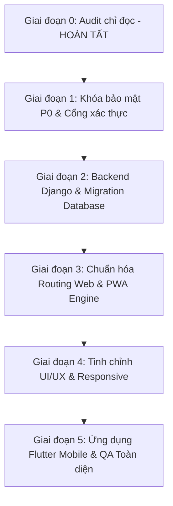

# MASTER AUDIT REPORT — PH DIGITAL EDUCATION

> **Ngày kiểm toán:** 01/09/2026  
> **Phiên bản:** 1.0.0-AUDIT-PHASE-0  
> **Chế độ kiểm tra:** Đọc chỉ định (Read-Only Audit) — Tuyệt đối không thay đổi mã nguồn  
> **Phạm vi:** Toàn bộ hệ sinh thái Website công khai (`https://tinhocgenz.io.vn/`), LMS PWA (`https://hoctructuyen.tinhocgenz.io.vn/`), Python/Django Backend, và Cấu hình Triển khai (GitHub Actions, Vercel).

---

## 1. THÔNG TIN MÔI TRƯỜNG & GIT BASELINE

* **Nhánh hiện tại:** `main` (Up to date with `origin/main`).
* **Trạng thái Git:** `working tree clean` (Không có uncommitted changes hay untracked files dư thừa).
* **Commit gần nhất:** `95c8cf8` — *feat(auth): enhance first-time password modal with strength meter and eye toggles, add self-service account recovery via automated email OTP*.
* **Môi trường Python:** Python 3.11.9 (venv: `backend/venv`).
* **Môi trường Node:** Node.js v20+, Vite 5.4.21, React 18.3.1, TypeScript 5.5.3.

---

## 2. KẾT QUẢ KIỂM TRA BASELINE TỰ ĐỘNG

| Bộ kiểm tra | Lệnh thực thi | Kết quả | Chi tiết / Ghi chú |
| :--- | :--- | :---: | :--- |
| **Django System Check** | `python manage.py check` | **PASS (0 errors)** | Hệ thống backend cấu hình hợp lệ cú pháp |
| **Django Deploy Check** | `python manage.py check --deploy` | **6 WARNINGS** | `HSTS`, `SECURE_SSL_REDIRECT`, `SECRET_KEY`, `SESSION_COOKIE_SECURE`, `CSRF_COOKIE_SECURE`, `DEBUG=True` |
| **Django Migrations** | `python manage.py makemigrations --check --dry-run` | **PASS** | Không có migration tồn đọng |
| **Backend Pytest** | `pytest backend/tests` | **PASS (9/9)** | 9/9 tests pass (5.48s) |
| **Backend Coverage** | `coverage run -m pytest` | **95%** | 865 dòng code, miss 47 dòng |
| **Frontend Typecheck** | `npx tsc --noEmit` | **PASS (0 errors)** | Toàn bộ codebase TypeScript biên dịch sạch |
| **Frontend Unit Tests** | `npm test` (`tests/run-tests.mjs`) | **PASS (51/51)** | 51 bài test cấu trúc, auth, timer, storage đạt 100% |
| **Frontend Build** | `npm run build` | **PASS (Cảnh báo kích thước)** | Bundle chính `index-*.js` nặng **667.27 kB** (chưa nén), `vendor-qrcode` nặng **334.29 kB** |
| **Flutter CLI** | `Get-Command flutter` | **Chưa cài đặt** | Cần thiết lập môi trường Flutter SDK ở Phase 5 |

---

## 3. BẢNG PHÂN TÍCH TỔNG HỢP VẤN ĐỀ (P0 — P1 — P2 — P3)

| ID | Vai trò | URL / File | Vấn đề | Bằng chứng | Mức độ | Nguyên nhân | Cách sửa | Rủi ro | Trạng thái |
| :---: | :--- | :--- | :--- | :--- | :---: | :--- | :--- | :--- | :---: |
| **SEC-01** | Quản trị / Bảo mật | `src/components/auth/UnifiedAuthGateway.tsx:393` | Hardcode mật khẩu quản trị trực tiếp trong JavaScript client bundle | `const isAdminPass = cleanPin === 'admin@phedu2026' \|\| cleanPin === 'admin123';` | **P0** | Cơ chế xác thực mock client-side phục vụ demo | Xóa bỏ toàn bộ hardcode pass; chuyển xác thực sang Django REST API băm Argon2id | Lỗi login nếu client chưa kết nối API | ĐÃ XÁC MINH |
| **SEC-02** | Quản trị / An ninh | `src/components/admin/StandaloneAdminApp.tsx:76, 285-305` | Cổng Quản trị `/admin` có nút bấm "Super Admin" tự động đăng nhập bypass | Nút "Đăng nhập Super Admin (Thầy Huy)" gọi `handleQuickAdminLogin` tự điền pass và login | **P0** | Tiện ích dev/demo để quên trong production | Xóa sạch nút Quick Login Super Admin; yêu cầu form POST có CSRF và MFA | Cán bộ nội bộ mất tiện ích đăng nhập 1-click | ĐÃ XÁC MINH |
| **SEC-03** | Khách / SEO / Admin | `public/sitemap.xml:10`, `public/robots.txt:3` | Route `/admin` công khai trong Sitemap và chưa bảo vệ bằng xác thực máy chủ | `<loc>https://hoctructuyen.tinhocgenz.io.vn/admin</loc>` với priority `0.9` trong sitemap | **P0** | Cấu hình SEO thêm nhầm route quản trị vào sitemap công khai | Xóa ngay `/admin` khỏi `sitemap.xml`; thêm header `X-Robots-Tag: noindex, nofollow, noarchive` | Giảm hiển thị admin trên Google (đúng mục đích) | ĐÃ XÁC MINH |
| **SEC-04** | Người dùng / Auth | `src/services/accountRecoveryService.ts:77-94` | Mã xác nhận OTP khôi phục tài khoản lưu dạng Cleartext trong `localStorage` | `localStorage.setItem('phtgz_recovery_session', JSON.stringify({ otpCode: otp }))` | **P0** | Giả lập luồng Email OTP hoàn toàn ở client | Chuyển luồng OTP sang Django Backend, gửi email SMTP/SES thật, lưu mã băm có TTL trong Redis | Cần cấu hình dịch vụ gửi mail máy chủ | ĐÃ XÁC MINH |
| **SEC-05** | Học viên & Giảng viên | `src/hooks/useAuth.ts:21-250` | Dữ liệu cá nhân, SĐT, Email và mật khẩu `123` lưu hoàn toàn trong `localStorage` | Khóa `phtinhocgenz_student_accounts_v11` và `phtinhocgenz_teacher_accounts_v11` | **P0** | Mô hình Client Storage độc lập, chưa đồng bộ Database | Viết script import toàn bộ accounts vào PostgreSQL; chuyển frontend sang gọi API phiên | Xáo trộn tài khoản nếu không migrate dữ liệu cẩn thận | ĐÃ XÁC MINH |
| **SEC-06** | Bản quyền / Riêng tư | `src/utils/googleDriveService.ts:8`, `src/hooks/useAttendanceStorage.ts:25-34` | Hardcode URL Google Drive thư mục bài nộp và liên kết Google Meet phòng học | `masterFolderUrl: 'https://drive.google.com/drive/folders/1LxB7Dqd8LowIiuP5TL-3JFmnGnSPhIxL...'` | **P0** | Hardcode đường dẫn học liệu vào source code | Lưu Google Drive & Meet URLs vào database có RBAC; API chỉ trả link khi học viên đã điểm danh/đúng lớp | Học viên không xem được link nếu backend offline | ĐÃ XÁC MINH |
| **SEC-07** | Mọi vai trò | `src/hooks/useAuth.ts:678-682` | Hệ thống luôn mặc định `isAuthenticated: true`, tự gán tài khoản học viên mẫu khi mở web | `const starterStudent = INITIAL_STUDENT_ACCOUNTS[0];` khi chưa có session | **P0** | Thiết kế frontend để tiện xem trước màn hình | Chuyển sang phiên rỗng (`null`); bắt buộc xác thực hợp lệ mới cấp quyền truy cập LMS | Mọi người dùng phải đăng nhập lại | ĐÃ XÁC MINH |
| **SEC-08** | Khách vãng lai | `src/hooks/useAuth.ts:620-660` | Bất kỳ ai cũng có thể tự reset mật khẩu của học viên hoặc giảng viên bất kỳ | Hàm `resetUserPassword` tìm theo tên/mã và đổi ngay mật khẩu mà không kiểm tra xác thực danh tính | **P0** | Thiết kế thiếu bước verify OTP phía máy chủ | Đóng endpoint reset tự do; bắt buộc quy trình xác thực đa yếu tố hoặc giáo vụ reset | Người dùng quên pass phải đợi gửi email xác thực | ĐÃ XÁC MINH |
| **ARC-01** | Toàn hệ thống | Toàn bộ `src/hooks/*.ts` | Frontend hoạt động 100% trên LocalStorage, tách biệt hoàn toàn với Backend Django | Code Django trong `backend/` có models/views nhưng frontend chưa từng gửi `fetch`/`axios` đến API | **P1** | Giai đoạn xây dựng giao diện hoàn thành trước khi nối dây backend | Xây dựng API Client SDK (`src/services/api/`), thực hiện migration dữ liệu từng bước lên PostgreSQL | Cần đảm bảo tính sẵn sàng của backend | ĐÃ XÁC MINH |
| **ARC-02** | Toàn hệ thống | `src/App.tsx:49-62` | Định tuyến thủ công SPA bằng chuỗi URL không đồng nhất, không có router chuyên nghiệp | `window.location.pathname` tự parse `admin`, `teacher`, `student` trên 1 tệp `App.tsx` 943 dòng | **P1** | Chưa tách route chuẩn theo từng role và phân hệ | Chuẩn hóa cấu trúc Route sạch theo spec: `/login`, `/app/student/*`, `/app/teacher/*`, `/admin/*` | Thay đổi cấu trúc điều hướng | ĐÃ XÁC MINH |
| **ARC-03** | Hiệu năng / PWA | `dist/assets/index-*.js` | Kích thước bundle JavaScript quá lớn (667 kB uncompressed), tải trước toàn bộ code Admin cho học viên | Cảnh báo Vite Build: `chunks are larger than 600 kB after minification` | **P1** | Không sử dụng `React.lazy()` và dynamic `import()` cho các cổng nội bộ | Tách chunk (Code Splitting): Lazy load `StandaloneAdminApp`, `TeacherAcademicPortal`, `QuizCreator` | Cần xử lý fallback Suspense mượt mà | ĐÃ XÁC MINH |
| **PERF-01** | PWA / Caching | `public/sw.js:33-44` | Service Worker sử dụng chiến lược Cache-First thô sơ cho mọi GET request | `caches.match(event.request)` không phân biệt API hay HTML động | **P1** | Template Service Worker cơ bản | Áp dụng Stale-While-Revalidate cho static hashed assets, Network-Only cho API, Auth và Dashboard | Nguy cơ cache dữ liệu cá nhân nếu làm sai | ĐÃ XÁC MINH |
| **UX-01** | Giao diện di động | `index.html:15` | Thẻ Viewport cấm phóng to thu nhỏ, vi phạm tiêu chuẩn Accessibility | `maximum-scale=1.0, user-scalable=no` | **P2** | Cố định layout tránh vỡ giao diện trên điện thoại cũ | Xóa bỏ `maximum-scale=1.0, user-scalable=no` theo chuẩn WCAG 2.2 AA | Cần kiểm tra kỹ responsive trên màn hình nhỏ | ĐÃ XÁC MINH |
| **UX-02** | Định dạng & Thương hiệu | `public/manifest.json:8` vs `index.html:49` | Bất đồng bộ Theme Color giữa HTML Meta (`#2563eb`) và Web Manifest (`#4f46e5`) | `index.html: #2563eb` (Xanh Royal) vs `manifest.json: #4f46e5` (Tím Indigo) | **P2** | Cấu hình theme color chưa đồng nhất qua các lần cập nhật | Đồng bộ về màu chủ đạo chính thức của thương hiệu PH Digital Education (`#1e40af` hoặc `#2563eb`) | Không có | ĐÃ XÁC MINH |
| **UX-03** | Trải nghiệm PWA | `public/manifest.json:9` | Khóa hướng màn hình cứng nhắc `orientation: portrait-primary` | Học viên không thể xoay ngang điện thoại để làm bài tập Excel hoặc xem sơ đồ lớn | **P2** | Thiết lập mặc định của template PWA | Mở khóa xoay màn hình linh hoạt cho phép học viên học tập đa chế độ | Cần test layout bảng tính khi xoay ngang | ĐÃ XÁC MINH |
| **SEO-01** | Marketing / Khảo thí | `src/components/auth/UnifiedAuthGateway.tsx:246, 329` | Tuyên bố chưa chính xác: "Mã hóa SSL 256-bit", "Đăng nhập an toàn SSO" | Tuyên bố xuất hiện trên thẻ xác thực trong khi hệ thống chạy local storage mock | **P2** | Nội dung copy marketing chưa khớp thực tế kỹ thuật | Chuẩn hóa thông điệp: "Hệ thống khảo thí Tin học chuẩn Quốc tế • Cổng xác thực đào tạo PH Digital" | Không có | ĐÃ XÁC MINH |
| **PRIV-01** | Bảo vệ dữ liệu | `src/utils/securityUtils.ts:31-36` | Gọi đồng thời 4 dịch vụ tra cứu IP công cộng bên ngoài không cần thiết | `api.ipify.org`, `api64.ipify.org`, `ipapi.co`, `api.my-ip.io` | **P2** | Client tự tìm IP để chống gian lận điểm danh | Lấy IP trực tiếp từ request header trên Django Backend (`X-Forwarded-For` / `REMOTE_ADDR`) | Không có | ĐÃ XÁC MINH |
| **MOB-01** | Ứng dụng Mobile | Workspace root | Chưa có mã nguồn ứng dụng di động Flutter dùng chung cho Học viên và Giảng viên | Chưa tìm thấy thư mục `mobile/` hoặc project Flutter | **P3** | Dự án đang trong giai đoạn web/PWA | Xây dựng ứng dụng Flutter hoàn chỉnh tại Phase 5 tích hợp Backend API | Cần cấu hình môi trường Flutter & mobile build | ĐÃ XÁC MINH |

---

## 4. BẢNG PHÂN LOẠI CÁC THÀNH PHẦN: KEEP / REFACTOR / REPLACE / DELETE

| Thành phần | Đường dẫn / Đối tượng | Phân loại | Lý do & Hướng xử lý |
| :--- | :--- | :---: | :--- |
| **Ngân hàng câu hỏi & Đề thi** | `src/data/*`, `src/types/quiz.ts` | **KEEP** | Dữ liệu nội dung đề thi MOS, IC3, CNTT chuẩn mực, phong phú, giữ nguyên và import lên PostgreSQL |
| **Giao diện bài thi & Khảo thí** | `src/components/quiz/QuizRunner.tsx`, `QuizResult.tsx` | **KEEP** | Trải nghiệm thi thử, bấm giờ, phát hiện rời tab rất tốt; chỉ cần nối API lưu kết quả thật |
| **CSS Tokens & Design System** | `src/index.css` | **KEEP** | Hệ thống màu, typography Plus Jakarta Sans, gradient, hiệu ứng mượt mà đạt tính thẩm mỹ cao |
| **Quản trị / Giáo vụ UI** | `src/components/admin/AdminPortal.tsx` | **REFACTOR** | Giữ nguyên các dashboard thống kê, điểm danh; refactor tách biệt thành route riêng có bảo vệ RBAC |
| **Luyện tập theo kỹ năng** | `src/components/practice/PracticeBySkill.tsx` | **REFACTOR** | Tính năng hữu ích cho người học; refactor để nhận dữ liệu thống kê từ Backend API |
| **Service Worker** | `public/sw.js` | **REFACTOR** | Viết lại chiến lược caching (Cache-First cho assets, Network-Only cho Auth & API, có Offline fallback) |
| **Xác thực người dùng** | `src/hooks/useAuth.ts`, `UnifiedAuthGateway.tsx` | **REPLACE** | Thay thế toàn bộ logic mock local storage bằng API Session/Cookie chuẩn mực của Django REST Framework |
| **Lưu trữ dữ liệu bài làm & điểm danh** | `useAssignmentStorage.ts`, `useAttendanceStorage.ts` | **REPLACE** | Thay thế LocalStorage bằng Django REST API endpoints (`/api/v1/assignments/`, `/attendance/`) |
| **Nút "Super Admin" & Auto Login** | `StandaloneAdminApp.tsx:285-305` | **DELETE** | Lỗ hổng bảo mật nghiêm trọng; xóa bỏ vĩnh viễn khỏi toàn bộ giao diện và bundle |
| **Thông tin Admin trên Sitemap** | `public/sitemap.xml:9-14` | **DELETE** | Xóa thẻ `<loc>.../admin</loc>` khỏi sitemap công khai để tránh lộ thông tin nội bộ trên Google Search |
| **Hardcode Passwords & PINs** | `src/hooks/useAuth.ts:393, 21-250` | **DELETE** | Xóa sạch toàn bộ mảng tài khoản chứa password `123` và admin pass trong mã nguồn frontend |
| **Hardcode Google Drive & Meet** | `src/utils/googleDriveService.ts:8`, `useScheduleStorage.ts` | **DELETE** | Xóa toàn bộ URL hardcode; đưa vào PostgreSQL quản lý theo từng lớp học cụ thể |

---

## 5. KẾ HOẠCH TRIỂN KHAI THEO GIAI ĐOẠN

### Kế hoạch chi tiết từng giai đoạn:

1. **Giai đoạn 1 — Khóa bảo mật P0 (Thực hiện ngay sau khi được phê duyệt):**
   * Xóa bỏ hoàn toàn route `/admin` khỏi `sitemap.xml`.
   * Gỡ bỏ nút "Super Admin" và tài khoản `ADMIN` điền sẵn trên form.
   * Xóa bỏ toàn bộ hardcode mật khẩu (`admin@phedu2026`, `admin123`, `123`) khỏi frontend bundle.
   * Thiết lập `X-Robots-Tag: noindex, nofollow, noarchive` cho mọi trang quản trị/nội bộ.
   * Đóng cơ chế `resetUserPassword` tự do; bảo vệ phiên khôi phục mật khẩu.
   * Ẩn các liên kết Giáo vụ và Quản trị khỏi thanh điều hướng công khai, chỉ hiển thị sau khi đã xác thực đúng vai trò.

2. **Giai đoạn 2 — Hoàn thiện Backend Python/Django & Migration LocalStorage:**
   * Cấu hình Django settings chuẩn sản xuất (Argon2id password hasher, PostgreSQL adapter, session cookie an toàn, CSRF).
   * Tạo script di chuyển dữ liệu (Data Migration Script) trích xuất dữ liệu từ LocalStorage schema đưa vào PostgreSQL.
   * Hoàn thiện API endpoints `/api/v1/auth/login/`, `/logout/`, `/me/`, `/courses/`, `/exams/`, `/attendance/`.
   * Thiết lập RBAC chặt chẽ và Object-level permission chống IDOR.

3. **Giai đoạn 3 — Phân tách Route Web & PWA Cải tiến:**
   * Tách route độc lập: `/login`, `/app/student/*`, `/app/teacher/*`, `/academic/*`, `/admin/*`.
   * Lazy load các module nặng bằng `React.lazy()` để giảm kích thước bundle ban đầu xuống dưới 250 kB.
   * Tinh chỉnh Service Worker với chiến lược cache chuyên nghiệp; xóa bỏ `maximum-scale=1.0` để hỗ trợ accessibility chuẩn WCAG.

4. **Giai đoạn 4 — Hoàn thiện UI/UX & Tối ưu Responsive:**
   * Tối ưu Footer 4 cột chuẩn desktop, 2 cột tablet, accordion mobile; không tràn ngang (no horizontal overflow).
   * Tối ưu Bottom Navigation cho Học viên (5 tab: Hôm nay, Khóa học, Luyện tập, Lịch, Cá nhân) và Giảng viên.

5. **Giai đoạn 5 — Khởi tạo Ứng dụng Di động Flutter & Deep Linking:**
   * Khởi tạo kiến trúc ứng dụng Flutter sạch dùng chung cho Học viên và Giảng viên.
   * Triển khai Universal Links / App Links (`assetlinks.json`, `apple-app-site-association`).
   * Kiểm thử tự động trên ma trận thiết bị và kịch bản mạng yếu/offline.

---

## 6. PHÂN TÍCH RỦI RO & KẾ HOẠCH HOÀN NGUYÊN (ROLLBACK PLAN)

### 6.1. Ma trận Rủi ro
* **Rủi ro gián đoạn đăng nhập học viên hiện hữu (Mức độ: Cao):** Khi chuyển từ LocalStorage sang Database PostgreSQL, nếu dữ liệu tài khoản học viên không được migrate đầy đủ, học viên có thể không đăng nhập được.
  * *Biện pháp giảm thiểu:* Thực hiện backup dữ liệu LocalStorage thành file seed dữ liệu chuẩn (`initial_data.json`), nạp sẵn vào database trước khi switch frontend endpoint.
* **Rủi ro phân quyền sai (IDOR) (Mức độ: Cao):** Học viên có thể đoán ID bài tập hoặc điểm số của học viên khác.
  * *Biện pháp giảm thiểu:* Dùng UUID v4 cho toàn bộ tài nguyên chia sẻ; áp dụng bộ lọc queryset `filter(student=request.user)` ở cấp độ model manager của Django.
* **Rủi ro cache dữ liệu cá nhân của Service Worker (Mức độ: Trung bình):** Service worker cũ có thể lưu cache HTML chứa dữ liệu phiên cũ.
  * *Biện pháp giảm thiểu:* Bump phiên bản Service Worker (`ph-eduquest-v2`), thiết lập cơ chế xóa sạch cache khi người dùng bấm Logout.

### 6.2. Kế hoạch Hoàn nguyên (Rollback Plan)
1. **Git Rollback:** Mọi thay đổi trong từng giai đoạn đều được thực hiện trên feature branch riêng biệt (ví dụ: `phase-1-security-lockdown`). Không làm việc trực tiếp trên `main`.
2. **Commit Rollback:** Nếu phát hiện lỗi hồi quy trong quá trình chạy quality gate, sử dụng `git revert <commit-hash>` trên feature branch.
3. **Database Rollback:** Mọi migration Django đều có migration đảo ngược (`python manage.py migrate <app_name> <previous_migration>`).
4. **Vercel Rollback:** Vercel hỗ trợ tính năng Instant Rollback về bản deployment ổn định trước đó chỉ với 1 click trong Vercel Dashboard nếu bản Preview/Production có sự cố.
